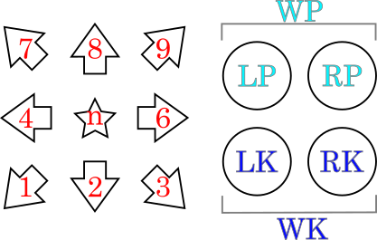

# tekken-code-image-web

Convert Tekken fighting game command notation (commonly in Japan) into SVG images.

This is a port of [osatetsu/tekken-code-image](https://github.com/osatetsu/tekken-code-image) (Obsidian plugin) to an HTML app.

## Usage

Enter a command using numeric directions and attack buttons.

````markdown
6n23RP
````

## 日本語

## 概要

格闘ゲームの鉄拳におけるコマンドをSVG画像へと変換するHTMLアプリです。

対応しているコマンドは、主に日本で使われるテンキー形式です。例えば風神拳なら `6n23RP` といった表記です。

## 記述ルール

方向、および、ボタン表記は画像のとおりです。



サポートしている記法:

* 方向
  * 数字(`1, 2, 3, 4, 6, 7, 8, 9`)
  * `n` または `N` - ニュートラル
* 攻撃ボタン
  * `LP` - 左パンチ
  * `RP` - 右パンチ
  * `WP` - 左右パンチ同時押し
  * `LK` - 左キック
  * `RK` - 右キック
  * `WK` - 左右キック同時押し
* スライド(攻撃ボタンを素早く順に押す)
  * `[ 攻撃ボタン ]`
    * なお、スライドとしての `WP` `WK` は記述不可
  * 例: `[ LK RP ]`
* 攻撃ボタンの同時押し
  * `+` を攻撃ボタンの間に記述
  * 例: `LP + RK`
* セパレーター
  * `>`
* 任意のテキスト
  * ダブルクォート記号 `"` で囲う。ただし、テキストとして `"` 記号を含めることは出来ない。
  * 例1: `"Counter Hit"`
  * 例2: `"日本語も可能"`
* スペース、カンマ
  * 効果は何もなく、単純に無視されます。
  * 例: `LP, RP, LK` と `LP RP LK` と `LPRPLK` は同じ意味


## 記述例

アリサの基本コンボ

````
3RP > 4LP > "ws" LPRP > 9LP > 66 > 9LP
````


## 制限事項

1. 現状、斜め方向(1, 3, 7, 9)の矢印図形は、他の矢印図形よりパディング(左右の隙間)が多いように見えます。バウンディングボックスを得るAPIによる都合です。
2. 本編ゲーム中にあるようなパワークラッシュなどのアイコンには、現状は非対応です。代替として任意テキストを用いてください。
3. コマンドの最大長は200文字としています。おそらく十分だとは思いますが、不都合があれば Issue から報告お願いします。


## ライセンス

MIT ライセンス
